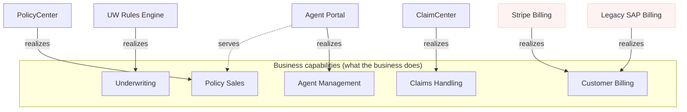

# Mode 4 — Model the enterprise · with skill

> **Prompt:** "We're an online insurance company. Our main business functions are selling
> policies, underwriting risk, handling claims, billing customers, and managing agents.
> Our systems are: PolicyCenter (policy admin), a custom underwriting rules engine,
> ClaimCenter, two separate billing systems (legacy SAP and a newer Stripe-based one), and
> an agent portal. Map our business capabilities to the applications that realize them."

---

**Framework & views:** ArchiMate 3.x — a **Capability Map** (Strategy layer) plus an
**Application Landscape** with explicit *realization* links (Application → Strategy).
The cross-layer realization links are the point of the exercise: they turn a list of
systems into a model that can answer "what breaks if we retire this?".

## 1 · Business capability map (Level 1)

Capabilities describe **what the business does**, independent of org chart and systems —
they stay stable while applications churn.

| EA ID | Capability | Definition |
|---|---|---|
| ea:acmeins:enterprise:capability:policy-sales | Policy Sales | Quote, bind, and issue new policies across channels |
| ea:acmeins:enterprise:capability:underwriting | Underwriting | Assess and price risk for new and renewing business |
| ea:acmeins:enterprise:capability:claims-handling | Claims Handling | Register, adjudicate, and settle claims |
| ea:acmeins:enterprise:capability:billing | Customer Billing | Invoice policyholders, collect premiums, manage dunning |
| ea:acmeins:enterprise:capability:agent-mgmt | Agent Management | Onboard, license, and support the agent network |

## 2 · Application landscape with realization links

| EA ID | Application | Realizes capability | Notes |
|---|---|---|---|
| ea:acmeins:enterprise:app:policycenter | PolicyCenter | ea:acmeins:enterprise:capability:policy-sales | Policy admin system of record |
| ea:acmeins:enterprise:app:uw-rules-engine | Underwriting Rules Engine | ea:acmeins:enterprise:capability:underwriting | Custom-built; single team owns it |
| ea:acmeins:enterprise:app:claimcenter | ClaimCenter | ea:acmeins:enterprise:capability:claims-handling | — |
| ea:acmeins:enterprise:app:sap-billing | Legacy SAP Billing | ea:acmeins:enterprise:capability:billing | ⚠ overlaps with Stripe billing |
| ea:acmeins:enterprise:app:stripe-billing | Stripe Billing | ea:acmeins:enterprise:capability:billing | ⚠ overlaps with SAP billing |
| ea:acmeins:enterprise:app:agent-portal | Agent Portal | ea:acmeins:enterprise:capability:agent-mgmt | Also *serves* Policy Sales (agent-initiated quotes) |

### View (Mermaid approximation of the ArchiMate Application Usage / Capability viewpoint)

*Mermaid can't render true ArchiMate notation — treat this as a readable approximation;
the model-of-record would live in Archi (Open Exchange Format).*

## 3 · What the model surfaces

1. **Rationalization candidate — Customer Billing is realized twice.** Two applications
   (Legacy SAP Billing, Stripe Billing) realize one capability. That's the classic
   post-growth duplication signal. Recommended next step: a TIME assessment of both
   (business value × technical fit → Tolerate / Invest / Migrate / Eliminate) and a
   consolidation decision recorded as an ADR — likely *Eliminate* for one of the two, with
   the migration sequenced around contract end-dates.
2. **Single-owner risk on Underwriting.** The custom rules engine is the only realization
   of Underwriting — worth checking bus-factor and documenting it (arc42 §11 risk).
3. **The Agent Portal crosses capabilities.** It realizes Agent Management but also serves
   Policy Sales; any portal change impacts two capabilities — the serving link makes that
   visible before a release breaks quoting.

## Suggested follow-ups (routed to other modes)

- Record the billing consolidation decision as an **ADR** (Mode 2).
- Draw the **C4 Container view** of whichever billing system survives (Mode 1).
- If leadership wants the transformation plan, structure it as **Baseline → Target → Gap →
  Roadmap** with transition plateaus (TOGAF, Mode 4 engagement framing).
