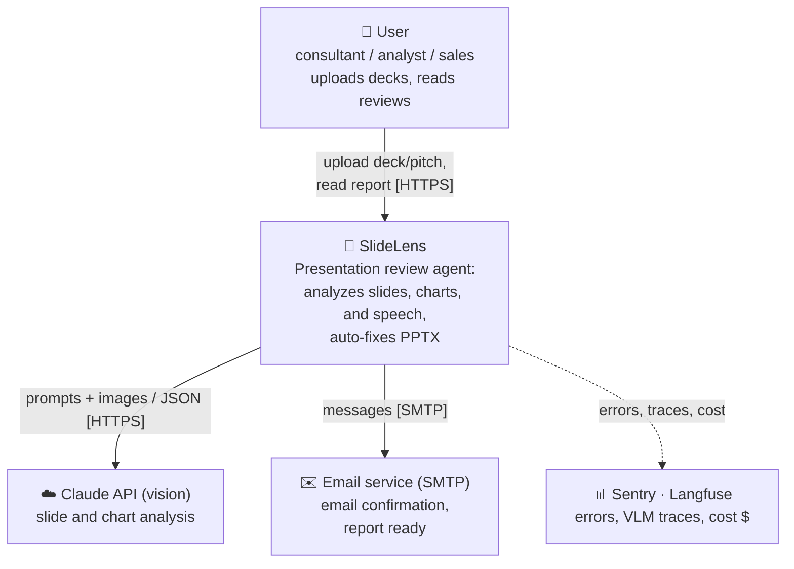
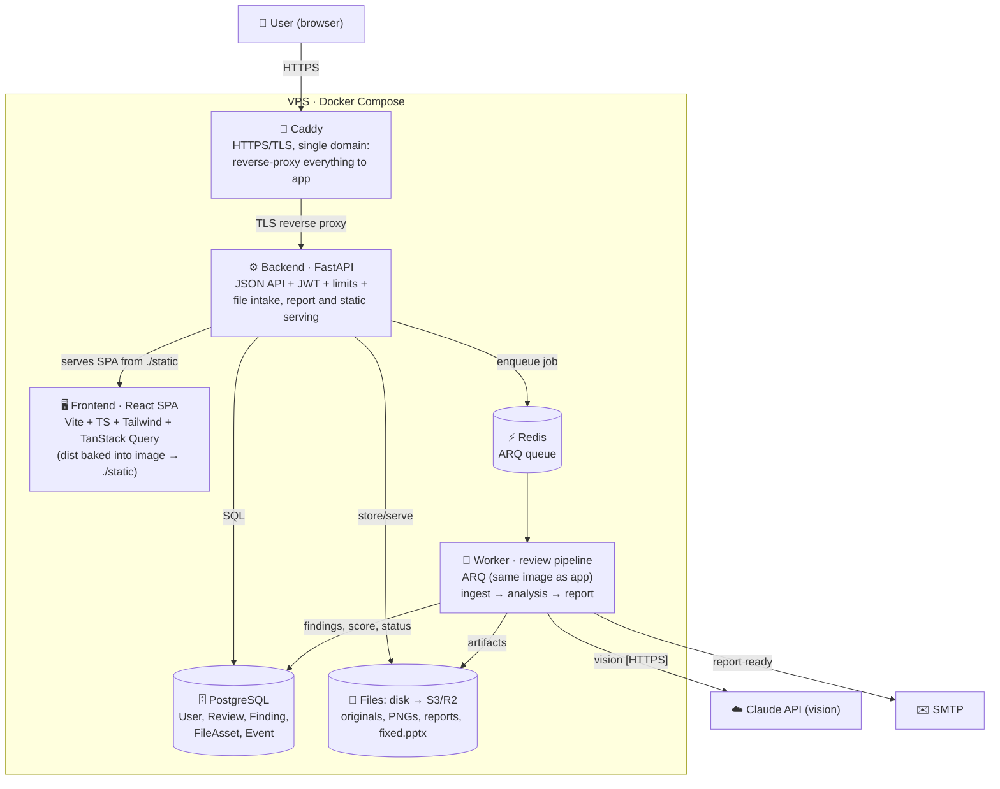
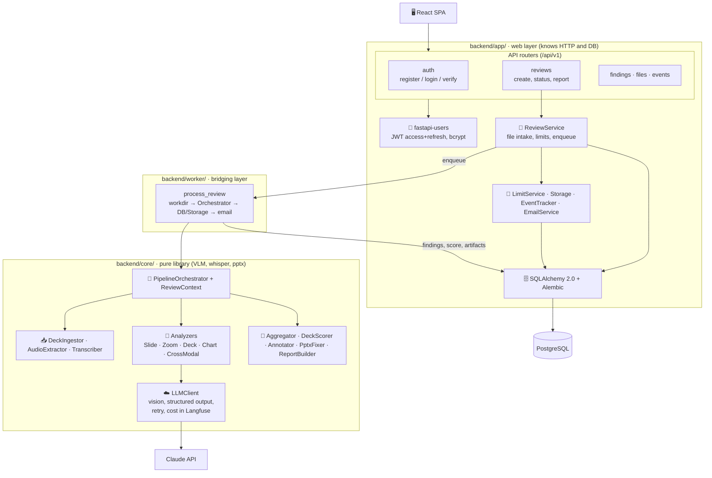
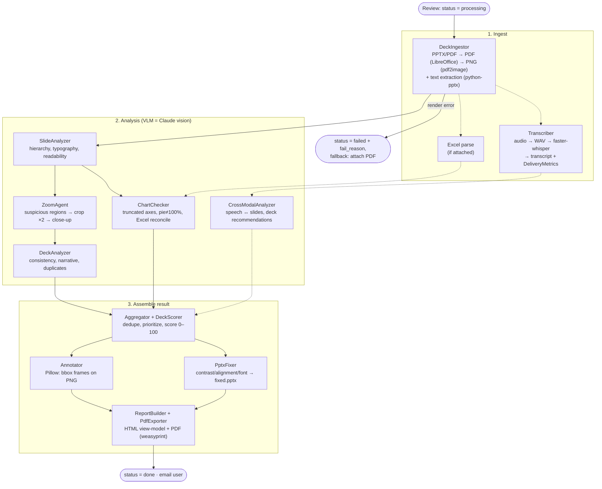
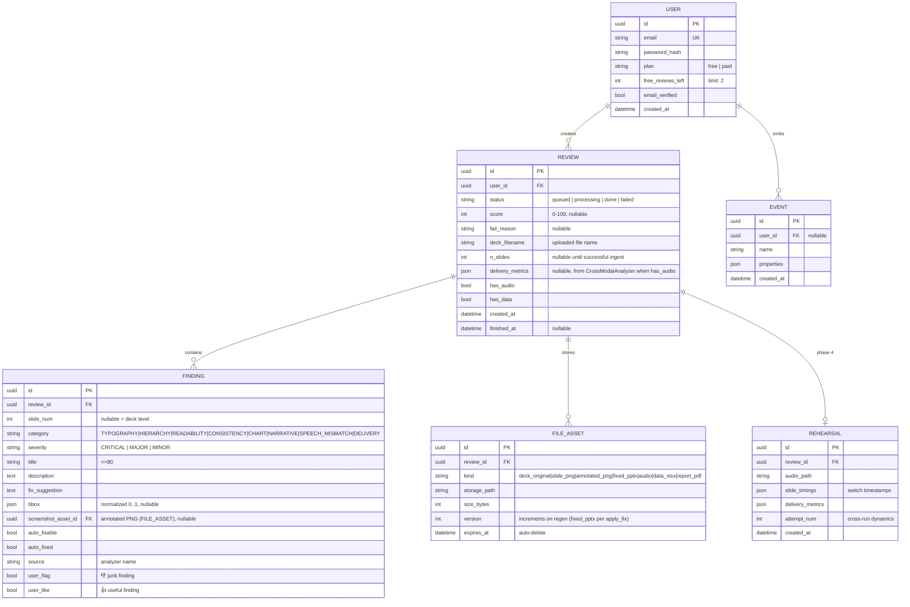
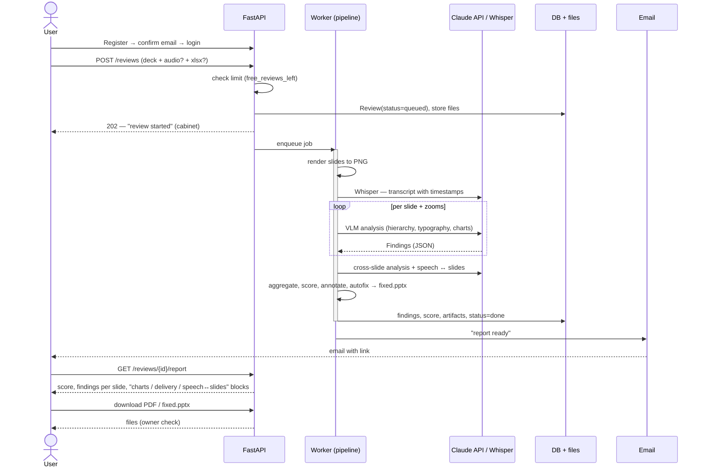

# Architecture diagrams (C4)

Levels C1–C3 follow the [C4 model](https://c4model.com/); the classic level 4 (“code”) is replaced by a data-model ERD — SQLAlchemy models are written from it. Plus a Review pipeline diagram and a sequence for the key flow. Terms — per [CONTEXT.md](../CONTEXT.md); decisions — per [ADR](../adr/).

> The same diagrams also exist as sources in [docs/diagrams/](diagrams/) ([d2](https://d2lang.com/) format) for building a polished PDF report — see [report/](../report/). Mermaid below is a render-independent variant readable directly on GitHub.

## C1 — System context

*Audience:* stakeholder — who uses the system and what it talks to externally. Whisper and python-pptx are omitted: they are internal libraries, not external services. Observability is dashed — a dev/ops plane, not a runtime dependency (if Langfuse is down, the Review continues).

## C2 — Containers

Prod: Docker Compose on a VPS. The built SPA is baked into the backend image (`./static`) and served by FastAPI itself; Caddy on a single domain terminates TLS and reverse-proxies all traffic to app (no CORS) — see [DEPLOY.md](DEPLOY.md).

One origin for API and static → no CORS and no nginx ([ADR 0004](../adr/0004-stack-fastapi-react.md)). The Review runs in the worker, not in the HTTP request ([ADR 0003](../adr/0003-async-review-worker.md)).

*Audience:* developer/DevOps — what actually deploys and where data, queue, and files live.

## C3 — Backend and pipeline components

Hard boundary: `backend/core/` is a pure library — it does not import `backend/app/` and does not talk to the DB; only the worker bridges them ([ADR 0001](../adr/0001-pipeline-pure-library.md)).

*Audience:* developer — how the web layer and pipeline are decomposed, and where the “app knows DB ↔ core is pure” boundary sits. All VLM calls go through the single `LLMClient` ([ADR 0002](../adr/0002-vlm-pipeline-hybrid-analyzers.md)).

## Review pipeline

Ten steps from uploaded Deck to Report. Failure of any analyzer does not kill the Review — a partial report beats `failed` ([ADR 0002](../adr/0002-vlm-pipeline-hybrid-analyzers.md)).

*Audience:* developer — step order and pipeline modules; dashed lines are optional branches (audio/Excel are not always attached).

## Level 4 — Data model (ERD)

Instead of classic C4 “code”: SQLAlchemy models are written from this schema. `FindingRow` mirrors the pipeline pydantic `Finding` ([ADR 0001](../adr/0001-pipeline-pure-library.md)).

Model notes:
- **Score and Findings are persisted** — the Report (`ReportOut`) is assembled from `FINDING` + `FILE_ASSET`, stored, and served via `GET /reviews/{id}/report`.
- **`bbox`** — normalized coordinates `0..1` (dpi-independent); used to draw frames on PNG.
- **`FILE_ASSET.expires_at`** — privacy (US-8): a periodic job deletes expired files from Storage.
- **`REVIEW.delivery_metrics`** — Delivery for a pitch Recording attached to the Review (MVP, US-2/US-4). Separate from `REHEARSAL`, which stays empty for phase 4 (in-browser recording with precise `SlideTiming`, cross-run dynamics).
- **`user_flag` (👎) / `user_like` (👍)** — mutually exclusive votes; flow into Langfuse as a dataset for prompt iteration ([ADR 0007](../adr/0007-three-layer-observability.md)). Targeted autofix — `POST /findings/{id}/apply_fix` (set `auto_fixed`, regen `fixed.pptx` from the original).
- **`REHEARSAL`** — empty stub for phase 4 ([ADR 0005](../adr/0005-crossmodal-delivery-analysis.md)); not populated in MVP, but created so the feature does not break the schema.

*Audience:* developer — SQLAlchemy models are written directly from this ERD.

## Sequence: user path (upload → report)

*Audience:* developer — happy path of the product nail; the `failed` branch (render error) and ownership errors (404) are documented in [api/openapi.yaml](../api/openapi.yaml) and omitted here.
