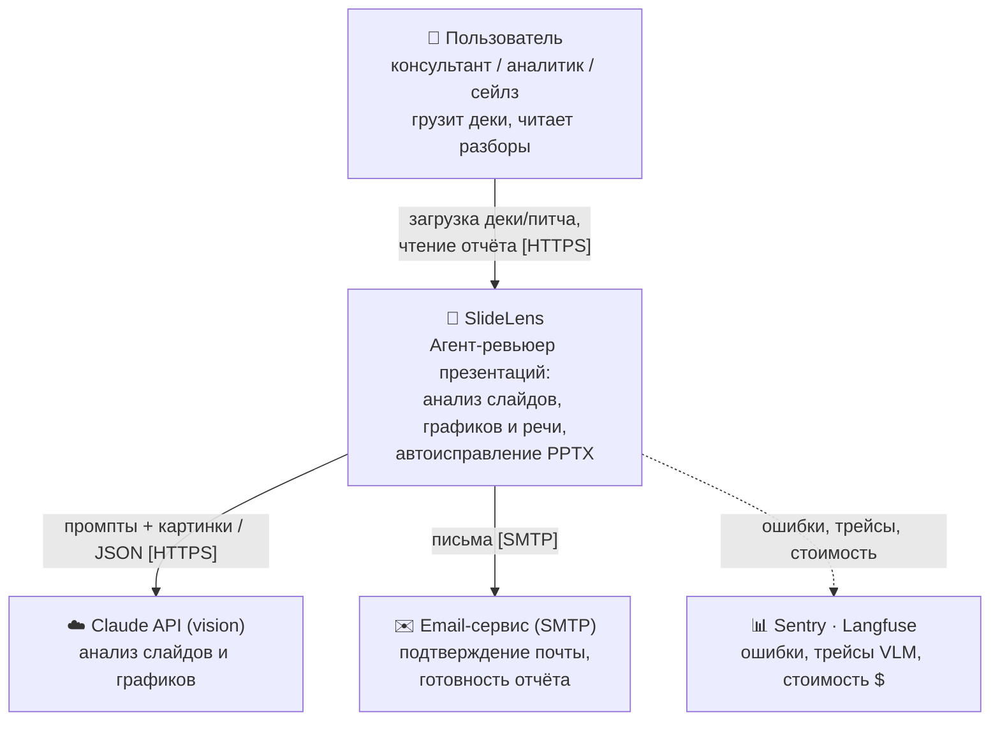
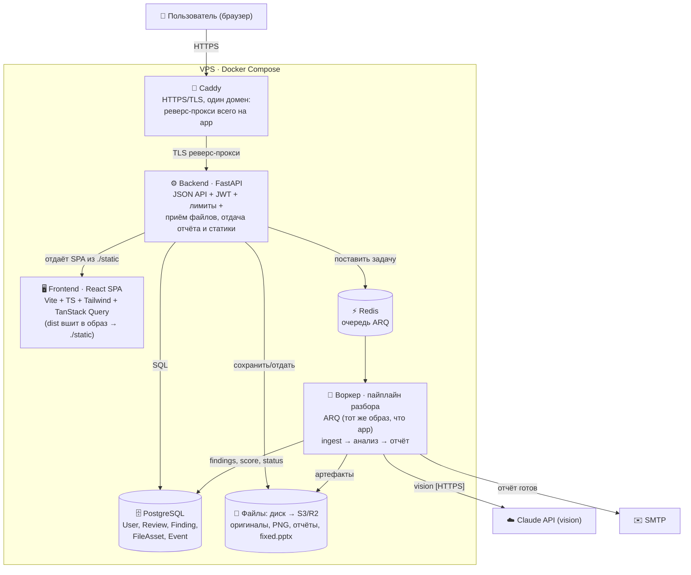
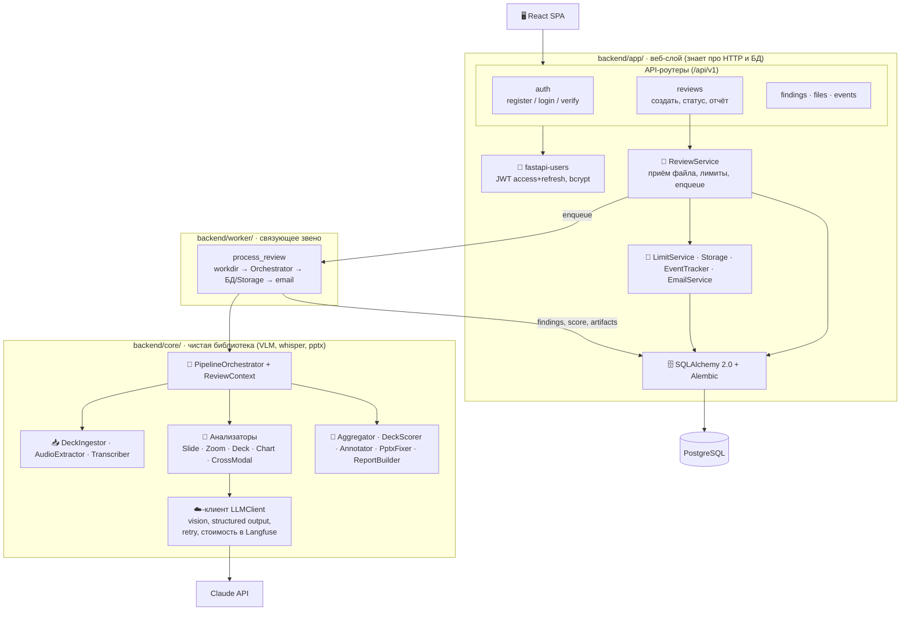
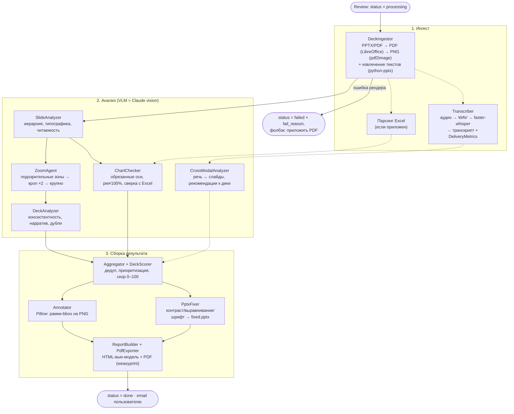
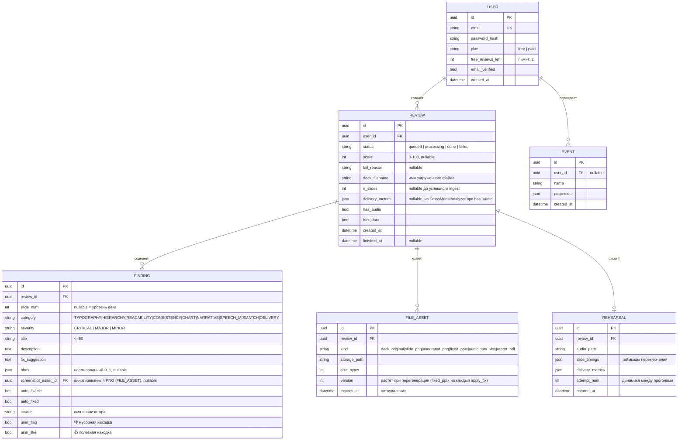
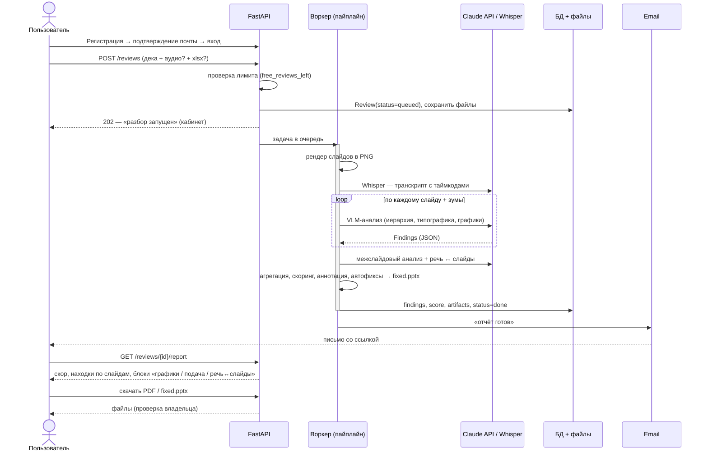

# Архитектурные диаграммы (C4)

Уровни C1–C3 по [модели C4](https://c4model.com/); классический уровень 4 («код») заменён ERD модели данных — по ней пишутся SQLAlchemy-модели. Плюс диаграмма пайплайна Разбора и sequence ключевого флоу. Термины — по [CONTEXT.md](../CONTEXT.md), решения — по [ADR](../adr/).

> Те же диаграммы есть исходниками в [docs/diagrams/](diagrams/) (формат [d2](https://d2lang.com/)) для сборки «красивого» PDF-отчёта — см. [report/](../report/). Mermaid ниже — рендер-независимый вариант, читается прямо на GitHub.

## C1 — Контекст системы

*Для кого:* стейкхолдер — кто пользуется системой и с чем она общается вовне. Whisper и python-pptx не показаны: это внутренние библиотеки, не внешние сервисы. Observability пунктиром — dev/ops-контур, не рантайм-зависимость (при недоступности Langfuse Разбор продолжается).

## C2 — Контейнеры

Прод: Docker Compose на VPS. Собранный SPA вшит в backend-образ (`./static`) и отдаётся самой FastAPI; Caddy на одном домене терминирует TLS и реверс-проксирует весь трафик на app (без CORS) — см. [DEPLOY.md](DEPLOY.md).

Один origin для API и статики → нет CORS и nginx ([ADR 0004](../adr/0004-stack-fastapi-react.md)). Разбор идёт в воркере, а не в HTTP-запросе ([ADR 0003](../adr/0003-async-review-worker.md)).

*Для кого:* разработчик/DevOps — что реально разворачивается и где живут данные, очередь и файлы.

## C3 — Компоненты бэкенда и пайплайна

Граница жёсткая: `backend/core/` — чистая библиотека, не импортирует `backend/app/` и не ходит в БД; связывает их только воркер ([ADR 0001](../adr/0001-pipeline-pure-library.md)).

*Для кого:* разработчик — как декомпозированы веб-слой и пайплайн и где проходит граница «app знает про БД ↔ core чист». Все VLM-вызовы идут через единственный `LLMClient` ([ADR 0002](../adr/0002-vlm-pipeline-hybrid-analyzers.md)).

## Пайплайн Разбора

Десять шагов от загруженной Деки до Отчёта. Падение любого анализатора не валит Разбор — частичный отчёт лучше `failed` ([ADR 0002](../adr/0002-vlm-pipeline-hybrid-analyzers.md)).

*Для кого:* разработчик — порядок шагов и модули пайплайна; пунктир — опциональные ветки (аудио/Excel приложены не всегда).

## Уровень 4 — Модель данных (ERD)

Вместо классического C4-«кода»: по этой схеме пишутся SQLAlchemy-модели. `FindingRow` зеркалит pydantic-`Finding` пайплайна ([ADR 0001](../adr/0001-pipeline-pure-library.md)).

Замечания к модели:
- **Скор и Находки персистятся** — Отчёт (`ReportOut`) собирается из `FINDING` + `FILE_ASSET`, хранится и отдаётся `GET /reviews/{id}/report`.
- **`bbox`** — нормированные координаты `0..1` (не зависят от dpi), по ним рисуется рамка на PNG.
- **`FILE_ASSET.expires_at`** — приватность (US-8): периодическая задача удаляет истёкшие файлы из Storage.
- **`REVIEW.delivery_metrics`** — Подача по приложенной к Разбору Записи питча (MVP, US-2/US-4). Отдельно от `REHEARSAL`, которая остаётся пустой под фазу 4 (запись прямо в браузере с точным `SlideTiming`, динамика между прогонами).
- **`user_flag` (👎) / `user_like` (👍)** — взаимоисключающие голоса; утекают в Langfuse как датасет для итераций промптов ([ADR 0007](../adr/0007-three-layer-observability.md)). Точечный автофикс — `POST /findings/{id}/apply_fix` (набор `auto_fixed`, реген `fixed.pptx` из оригинала).
- **`REHEARSAL`** — пустая под фазу 4 ([ADR 0005](../adr/0005-crossmodal-delivery-analysis.md)); в MVP не заполняется, но заведена, чтобы фича не ломала схему.

*Для кого:* разработчик — по этой ERD пишутся SQLAlchemy-модели напрямую.

## Sequence: путь пользователя (загрузка → отчёт)

*Для кого:* разработчик — happy path гвоздя продукта; ветка `failed` (ошибка рендера) и ошибки владения (404) показаны в [api/openapi.yaml](../api/openapi.yaml), здесь опущены.
